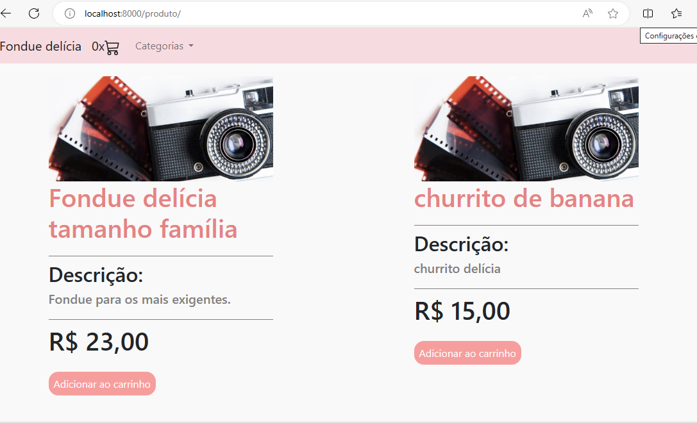
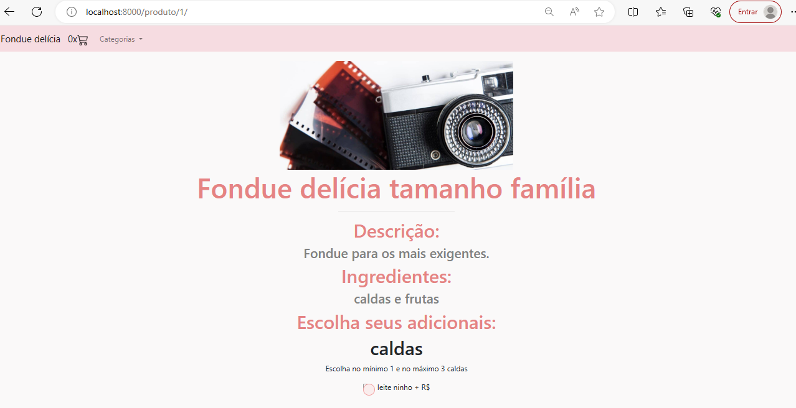
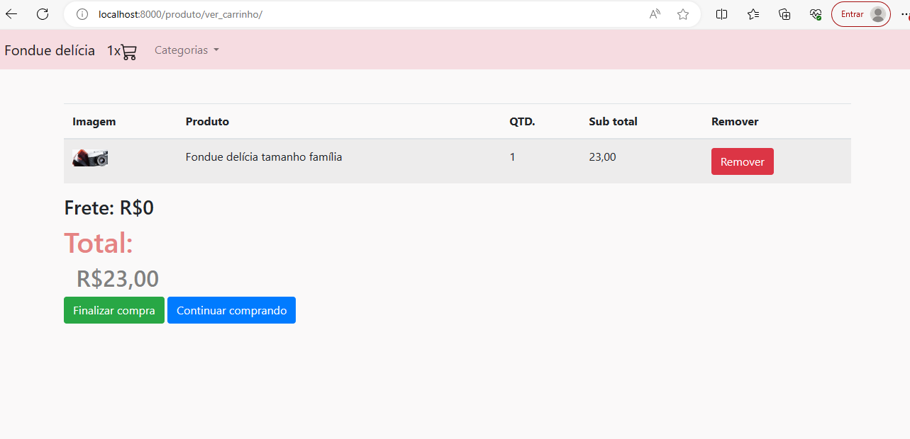
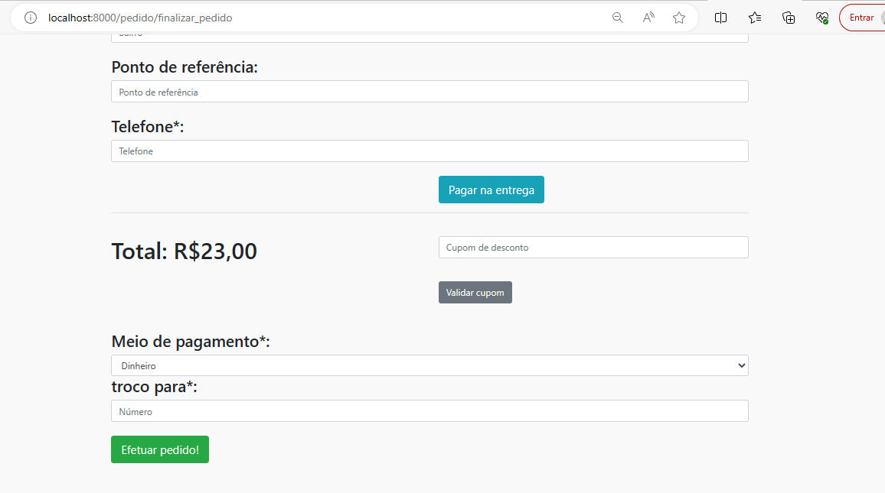
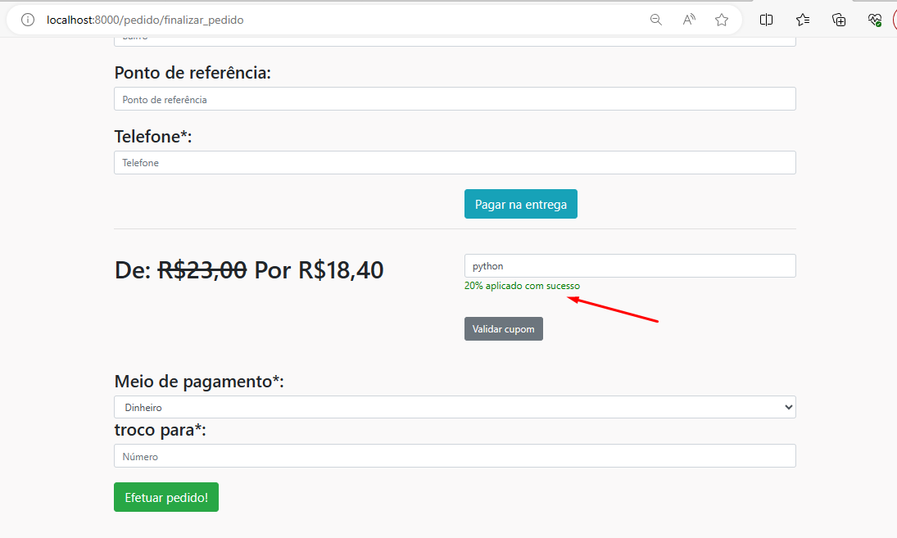
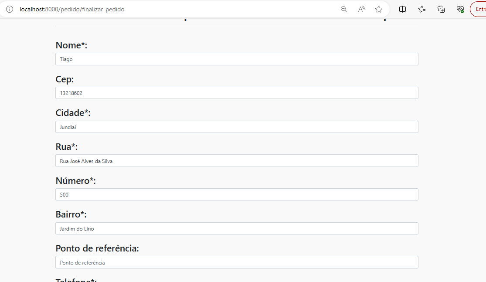
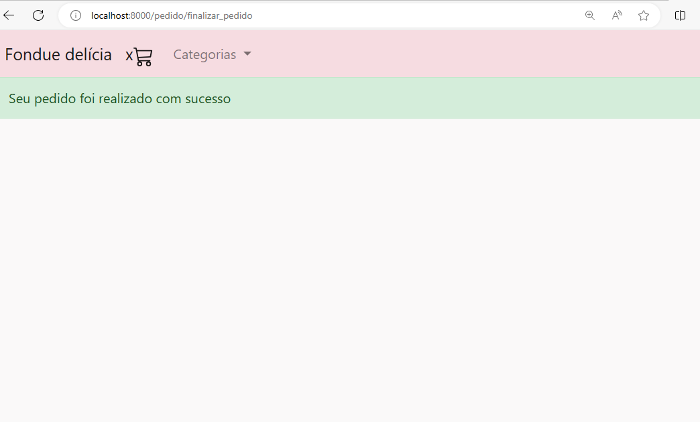

# Delivery - Django Project

## Simple system with shopping cart.

### You can:

###### - List products

###### - See details and select the options

###### - Add to the cart

###### - Must add between rules (mininum and maximum quantity)

###### - See the items added to the shopping cart

###### - Remove from the cart

###### - Create the order

###### - Apply cupom and automatically calculates the discount

###### - Automatically loads the address by Postal Code

###### - Creates the order, clean the cart

###### - Using the admin platform, you can manage orders, change status, create groups to the employees to enable who can see what, etc

---

To run the project you need to have [Python](https://www.python.org/downloads/).

Create a directory to the project and inside of it run this in cmd to create a virtual environment:
`python -m venv venv`

Now you need to activate the virtual environment. If you are under Linux or Mac run in cmd:
`source /venv/bin/activate`

If you are under windows run this in cmd:
`/venv/bin/activate.bat`

Once it is done, run in cmd:
`pip install -r requirements.txt`

In the root directory you have `.env copy`. Rename it to `.env` and put a key in the SECRET_KEY field.

Inside the settings.py file in the freelaway project directory, you have this field:

```
EMAIL_BACKEND=django.core.mail.backends.console.EmailBackend
```

For the test purpose, about the email fields, you can put any data because in the `EMAIL_BACKEND` variable we are using: `django.core.mail.backends.console.EmailBackend`
To send the email for real this must be changed to: `django.core.mail.backends.smtp.EmailBackend`

To run the project:
`python manage.py runserver`

To create a super user:
`python manage.py createsuperuser`

To enter the admininstration of the app, in the browser enter:
`http://127.0.0.1/admin/`

Enter the user you created in the step before.

In the cmd run this command to create the tables in database:
`python manage.py migrate`

---









Tiago Mendes
tetigo@gmail.com
